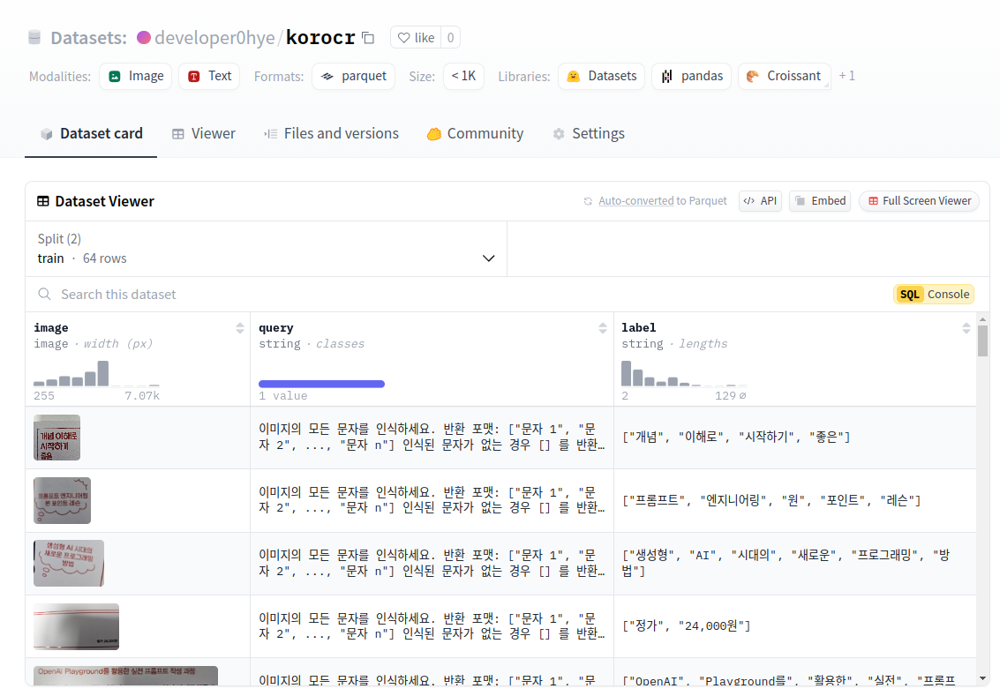
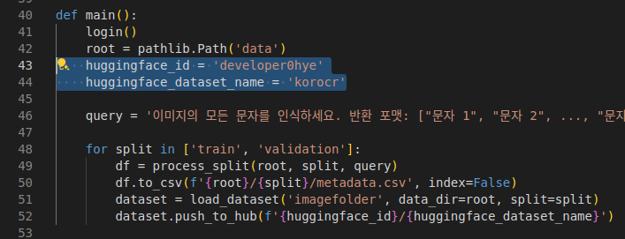

# hugging-face-image-ocr-dataset-upload-example

https://huggingface.co/datasets/developer0hye/korocr



Familiarize yourself with the code and dataset directory structure.

Refer to the [official documentation](https://huggingface.co/docs/datasets/image_dataset) to ensure you don't spend more than 12 hours uploading your dataset to Hugging Face Datasets.


```
git clone https://github.com/developer0hye/hugging-face-image-ocr-dataset-upload-example.git
cd hugging-face-image-ocr-dataset-upload-example
```

Replace the highlighted lines in `upload.py` with [your new repository](https://huggingface.co/new-dataset).


```
python upload.py
```
